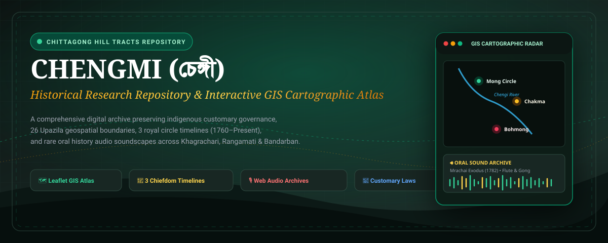
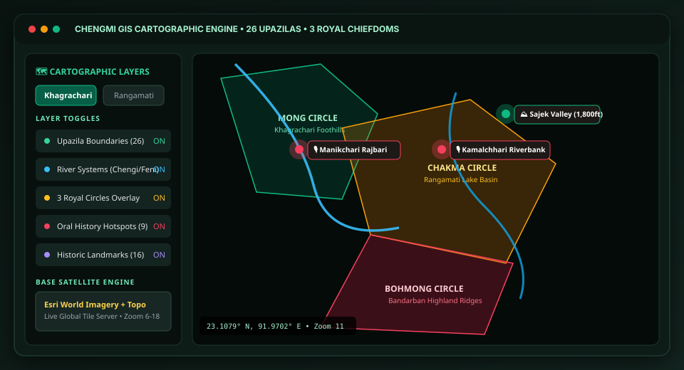
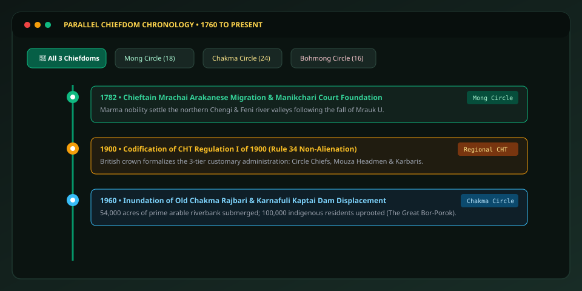
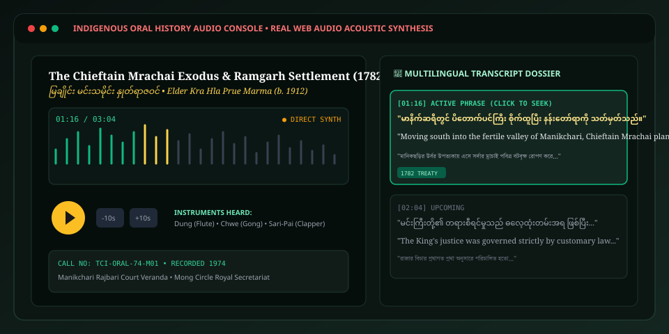

# Chengmi (চেঙ্গী) — Chittagong Hill Tracts Historical Repository & GIS Atlas

<p align="center">
  
</p>

<p align="center">
  <a href="https://react.dev/"></a>
  <a href="https://www.typescriptlang.org/"></a>
  <a href="https://vitejs.dev/"></a>
  <a href="https://tailwindcss.com/"></a>
  <a href="https://leafletjs.com/"></a>
  <a href="https://developer.mozilla.org/en-US/docs/Web/API/Web_Audio_API"></a>
</p>

---

## 📖 Overview

**Chengmi (চেঙ্গী)** is a comprehensive historical research repository, interactive chronological timeline, regional cartographic GIS atlas, and digital sound repository for **Khagrachari** and the wider **Chittagong Hill Tracts (CHT)** region in southeastern Bangladesh.

Named after the historic **Chengi (Chengmi) River** that flows through the heart of Khagrachari, this platform preserves the unbroken cultural legacy, customary jurisprudence, ancestral territorial demarcations, and oral memory of the region's indigenous peoples: the **Tripuri, Marma, Chakma, Mro, Bawm, Tanchangya, and Lushai** nations.

---

## 🗺️ Key System Capabilities

### 1. Interactive Regional GIS Cartographic Engine
<p align="center">
  
</p>

- **26 Upazila Vector Boundaries**: Precision polygon coordinates covering all Upazilas across **Khagrachari (9)**, **Rangamati (10)**, and **Bandarban (7)**.
- **3 Historic Royal Circles**: Interactive overlays for the **Mong Circle** (Khagrachari), **Chakma Circle** (Rangamati), and **Bohmong Circle** (Bandarban).
- **Riparian Arteries**: Geographic paths of the historic Chengi, Feni, Karnafuli, Sangu, and Matamuhuri river systems.
- **Historic Landmarks**: High-resolution geo-anchors for sacred sites including Matai Pukhiri (Debota Pond), Manikchari Rajbari, Old Rangamati Palace, and Keokradong.
- **Multi-Basemap Switching**: Live toggle between High-Res Satellite Imagery, Topographic Contours, and OpenTopoMap elevation profiles.

---

### 2. Parallel Chiefdom Chronology (1760 – Present)
<p align="center">
  
</p>

- **Side-by-Side Timeline**: Filter by individual royal houses or view synchronized cross-regional epochs.
- **Pre-Colonial Foundations**: The 1782 Arakanese Marma exodus under Chieftain Mrachai, Mughal cotton barter treaties (*Karpas Mahal*), and Tripuri royal alliances.
- **Colonial Governance**: Enactment of **CHT Regulation I of 1900**, establishing the customary 3-tier structure (Circle Chief → Mouza Headman → Village Karbari) and **Rule 34** land non-alienation protections.
- **Post-Colonial Crises & Accords**: The 1960 Kaptai Dam inundation (*Bor-Porok*), regional resistance, and the 1997 Chittagong Hill Tracts Peace Accord.

---

### 3. Indigenous Oral History Sound Archive
<p align="center">
  
</p>

- **Dual-Engine Acoustic Synthesis**: Powered by an offline **Web Audio API** engine synthesizing authentic tribal instruments (Bamboo Transverse Flute *Dung*, Bronze Ceremonial Gong *Chwe*, Hand Drum *Kham*, and *Plung* Gourd Mouth-Organ).
- **Synchronized Multilingual Transcripts**: Time-stamped phrase tracking across original indigenous scripts (Chakma Changma Vaj, Marma, Kokborok, Mro), English scholarly translations, and Bengali transcripts.
- **Scrubbable Waveform Canvas**: Audio seeking with variable playback speeds (0.75x to 1.5x) and one-click field recording citation exports.

---

### 4. Customary Legal & Administrative Dossiers
- **Primary Source Catalog**: Direct access to legal texts including the 1900 CHT Manual, Rule 34 court arbitration precedents, and 1958 Manikchari durbar rulings.
- **Academic Citation Generator**: Formats citations in APA, Chicago, Harvard, and MLA formats for scholars and human rights advocates.
- **Scholarship Blog & Research Journal**: Peer-reviewed articles on indigenous ecological water governance, sacred groves (*Para Bon*), and toponymic origins.

---

## 🛠️ Technology Stack

| Layer | Technologies |
| :--- | :--- |
| **Frontend Framework** | [React 19](https://react.dev/) + [TypeScript 5.7](https://www.typescriptlang.org/) |
| **Build & Tooling** | [Vite 6](https://vitejs.dev/) |
| **Styling & Design System** | [Tailwind CSS v4](https://tailwindcss.com/) with Custom Parchment & Emerald Academic Palettes |
| **GIS & Mapping** | [Leaflet](https://leafletjs.com/) with Custom Vector GeoJSON Layers |
| **Acoustic Audio** | Native HTML5 Audio + Custom Web Audio API Offline Synthesizer (`chtAudioEngine.ts`) |
| **Icons & Visuals** | [Lucide React](https://lucide.dev/) + Custom SVG Vector Cartography |

---

## 🚀 Getting Started

### Prerequisites
- Node.js (version 18 or higher recommended)
- `npm` or `bun`

### Installation

1. **Clone the repository**:
   ```bash
   git clone https://github.com/MachangDoniel/chengmi-cht-repository.git
   cd chengmi-cht-repository
   ```

2. **Install dependencies**:
   ```bash
   npm install
   # or
   bun install
   ```

3. **Start the local development server**:
   ```bash
   npm run dev
   ```
   Open [http://localhost:3000](http://localhost:3000) in your browser.

4. **Build for production**:
   ```bash
   npm run build
   ```

---

## 📁 Repository Structure

```text
chengmi-cht-repository/
├── assets/                       # Vector SVGs, banners & visual documentation
│   ├── banner.svg
│   ├── gis_preview.svg
│   ├── timeline_preview.svg
│   └── audio_preview.svg
├── src/
│   ├── components/               # React UI modules
│   │   ├── archive/              # Audio Archives & Historical Gallery viewers
│   │   ├── map/                  # Leaflet RealGISMap, historical survey sheet viewer
│   │   ├── timeline/             # Parallel Chiefdom timeline & circle modals
│   │   ├── Header.tsx            # Navigation, dark/light theme toggle, search
│   │   └── KhagrachariOverview.tsx
│   ├── context/                  # AuthContext and ThemeContext
│   ├── data/                     # Primary research datasets
│   │   ├── archiveData.ts        # Historical documents, maps & legal treaties
│   │   ├── audioArchivesData.ts  # Oral history transcripts, acoustic waveforms
│   │   ├── mapData.ts            # 26 Upazila coordinates, circle boundary data
│   │   └── timelineData.ts       # 1760–Present historical milestones
│   ├── services/                 # CHT Audio Engine & Full-Text Search Indexer
│   │   ├── chtAudioEngine.ts     # Web Audio API tribal acoustic synthesis
│   │   └── searchIndexer.ts
│   ├── types/                    # TypeScript interfaces
│   ├── App.tsx                   # Main application router
│   ├── main.tsx
│   └── index.css                 # Tailwind CSS v4 styling rules
├── package.json
├── tsconfig.json
├── vite.config.ts
└── README.md
```

---

## 📜 Customary Citation

When citing resources from this repository in academic or legal research, please use the following citation model:

```bibtex
@online{chengmi_cht_2026,
  author    = {Tripura, Doniel and Historical Research Contributors},
  title     = {Chengmi: Khagrachari & Chittagong Hill Tracts Historical Repository},
  year      = {2026},
  url       = {https://github.com/MachangDoniel/chengmi-cht-repository},
  publisher = {Chittagong Hill Tracts Historical Digital Initiative}
}
```

---

<p align="center">
  <b>Preserving Indigenous Heritage, Customary Rights, and Regional Memory across the Chittagong Hill Tracts</b>
</p>
